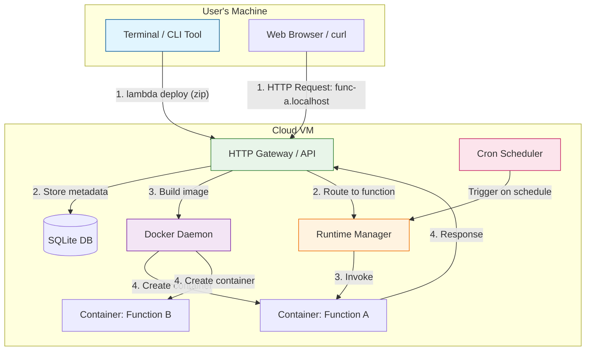

# Lambda (FaaS)
**Duration:** 8 Weeks
**Team Size:** 2 Developers
**Focus:** Serverless Computing, Event-Driven Architecture, Containerization

## 1. Project Overview
The goal of this internship is to build a simplified **Function as a Service (FaaS)** platform similar to AWS Lambda using **Go** programming language.

By the end of this project, you will have built a system that allows a user to deploy serverless functions via a CLI command (e.g., `lambda deploy ./my-function`), which will package the code, run it in an isolated container, and expose it via HTTP (e.g., `http://my-func.localhost`).

### Core Learning Objectives
*   **Container Runtime:** Building lightweight, fast-spinning containers for function execution.
*   **Event-Driven Design:** Understanding HTTP triggers, scheduled events, and async invocation patterns.
*   **Cold Start Optimization:** Learning about container pooling, warm instances, and startup latency.
*   **CLI Design:** Building intuitive developer tools using a suited Go library.


## 2. High-Level Architecture
The system consists of three main components:

1.  **The CLI (Client):** A command-line tool running on the user's machine. It packages function code and sends it to the server for deployment.
2.  **The Gateway (API + Router):** The "brain" of the operation. It receives function code, manages deployments, and routes HTTP requests to the appropriate function containers.
3.  **The Runtime Manager:** Manages Docker containers for function execution—spinning them up, handling invocations, and managing their lifecycle.

### System Diagram



## 3. Example Walkthrough

To understand the project better, here is how a developer will eventually use your platform:

### User Perspective (The CLI)
Imagine a developer has a simple function in a folder. They will use your tool like this:
```bash
$ cd my-function
$ lambda deploy . --name greet
[1/3] Packaging function code... Done.
[2/3] Building image "func-greet"... (Docker build output follows)
[3/3] Starting container... Done.

Your function is live at: http://greet.localhost
```

### Invoking the Function
```bash
$ curl "http://greet.localhost?name=World"
{"message": "Hello, World!"}

# Or via CLI
$ lambda invoke greet --data '{"name": "World"}'
{"message": "Hello, World!"}
```

### Scheduling a Function
```bash
$ lambda schedule greet --cron "0 * * * *"  # Run every hour
Scheduled function "greet" with cron: 0 * * * *
```

### Behind the Scenes (The Server Logic)
Internally, your **Gateway** code will look something like this (Go code):
```go
func handleInvoke(w http.ResponseWriter, r *http.Request) {
    // 1. Extract function name from the Host header (e.g., greet.localhost)
    // 2. Look up the function's container info from the database
    // 3. Forward the request to the container
    // 4. Return the function's response to the caller
}
```

## 4. Weekly Roadmap

### Phase 1: Foundation (Weeks 1-2)
*Goal: Learn to control Docker with Go and build the function packaging pipeline.*

#### **Week 1: Docker SDK Fundamentals & FaaS Concepts**
Instead of typing `docker run`, you will write Go code to do it for you.
*   **Objectives:**
    *   Set up the Go development environment.
    *   Research how AWS Lambda work internally.
    *   Connect to the Docker Daemon via the official Go SDK (`github.com/docker/docker/client`).
    *   Write a Go program to spin up/down containers quickly.
    *   Measure container startup times (baseline for optimization later).
*   **Deliverable:** A Go binary that spins up a function container and prints invocation latency.

#### **Week 2: Function Packaging & Build Pipeline**
Turning function code into a runnable container image.
*   **Objectives:**
    *   Create sample functions (hello-world, echo, calculator) with Dockerfiles.
    *   Implement a Go function to package source code into a `.tar.gz` archive.
    *   Use the Docker SDK to `ImageBuild` an image from the packaged source.
    *   Create a lightweight base image optimized for fast cold starts.
*   **Deliverable:** A Go function that builds a Docker image from function source code.

### Phase 2: Execution Engine (Weeks 3-4)
*Goal: Route HTTP traffic to functions and deploy to the cloud.*

#### **Week 3: HTTP Gateway**
Routing requests from the internet to the correct function container.
*   **Objectives:**
    *   Implement an HTTP gateway using `httputil.ReverseProxy`.
    *   Route requests based on subdomain (e.g., `greet.localhost` -> Function "greet").
    *   Inject request context (query params, headers, body) into the function.
    *   Handle function timeouts and error responses.
*   **Deliverable:** Invoking functions via HTTP requests.

#### **Week 4: Cloud Deployment & CI/CD**
Moving from "It works on my machine" to "It works on the Cloud".
*   **Objectives:**
    *   SSH into the provided Cloud VM and install Docker and Go.
    *   Create a GitHub Action that triggers on every `git push`:
        1.  Builds the Go binary.
        2.  Transfers it to the VM (via SCP/SSH).
        3.  Restarts the systemd service.
    *   Configure DNS to point subdomains to the VM.
*   **Deliverable:** Deploy a function from a laptop to the Cloud VM.

### Phase 3: Event System (Weeks 5-6)
*Goal: Add scheduled triggers and function versioning.*

#### **Week 5: Scheduled Triggers**
Running functions on a schedule.
*   **Objectives:**
    *   Implement a cron-style scheduler using a Go library (e.g., `robfig/cron`).
    *   Add `lambda schedule` CLI command.
    *   Handle overlapping executions (skip if still running vs. allow parallel).
    *   Implement async invocation queue.
*   **Deliverable:** Functions that run on a schedule.

#### **Week 6: State & Versioning**
Remembering what is deployed and supporting rollbacks.
*   **Objectives:**
    *   Implement SQLite for function metadata persistence.
    *   Add function versioning (each deploy creates a new version).
    *   Implement `lambda versions` and `lambda rollback` commands.
    *   Ensure database persistence across platform restarts.
*   **Deliverable:** Deploy new versions and rollback to previous ones.

### Phase 4: Polish (Weeks 7-8)
*Goal: Complete the CLI and prepare for demo.*

#### **Week 7: Observability & CLI Completion**
*   **Objectives:**
    *   Complete the CLI with all commands: `deploy`, `invoke`, `logs`, `list`, `delete`, `versions`, `rollback`, `schedule`.
    *   Implement `lambda logs` to stream logs from function containers.
    *   Add basic metrics (invocation count, duration, errors).
    *   Add authentication (API Key) so only authorized users can deploy.
*   **Deliverable:** Full-featured CLI with observability.

#### **Week 8: Documentation & Demo**
*   **Objectives:**
    *   Final code cleanup.
    *   Write user documentation.
    *   **The Demo:** You will present the project by deploying a fresh function to the live Cloud VM.


## 5. Technical Stack
*   **Language:** Go (Golang)
*   **Container Engine:** Docker (via Go SDK)
*   **Database:** SQLite
*   **CLI Framework:** Cobra
*   **HTTP Gateway:** Go `net/http` + `httputil.ReverseProxy`
*   **Scheduler:** `robfig/cron` or similar

## 6. Working Agreements & Expectations
We treat this internship as a simulation of a real engineering environment.

*   **The 3-Hour Rule:** If you are stuck on a specific error for more than 3 hours, stop and ask for help. We want you to struggle enough to learn, but not enough to burn out.
*   **Quality > Speed:** It is better to have a fully working function invocation than a broken complex system.
*   **Understanding is Key:** During code reviews, we will ask "Why?". You must be able to explain every line of code you write.
*   **Collaborate:** You are a team. Don't split the work in silos (e.g., "I do gateway, you do CLI"). Pair program on the hard parts.

## 7. Standards

### Communication
*   **Response:** Within 2 hours during working hours
*   **Meeting Attendance:** Mandatory unless communicated in advance
*   **Daily Updates:** Required - brief summary of progress and blockers
*   **Documentation:** All decisions and learnings must be documented

### Work Standards
*   **Code Quality:** Follow coding standards, passes linting
*   **Testing:** Should have basic tests
*   **PR Reviews:** Submit work in reviewable chunks, address feedback promptly
*   **Deadlines:** Meet timelines or communicate in advance

### General Workflow
*   **Monday:** Sprint Planning. Review the week's goals. Mentor provides a high-level overview of concepts. (30 min sync)
*   **Tue-Thu:** Implementation. Async communication over chat to flag blockers.
*   **Friday:** Code Review & Demo. Show what was built to the mentor. (30 min sync)
